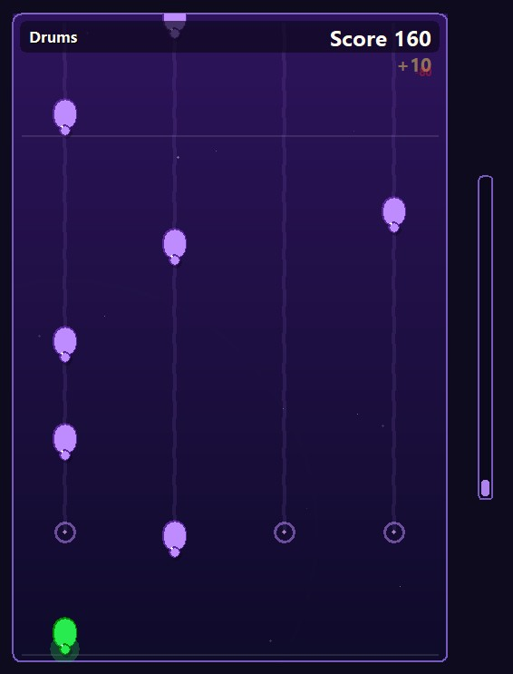

# Rhythm


This is a simple game that I created with the express purpose of gaining familiarity with Claude Code. It's a simple rhythm game for Win32, allowing a user to "play" various instruments and add them to the song in progress (inspired by the game Frequency)



## Features

- 4-lane note charts, played to original songs and Claude-generated "AI Slop" tracks
- Remappable inputs — keyboard, game controllers, and MIDI devices all supported
- An included chart editor for editing and building new tracks
- "Easy Mode" toggle that auto-simplifies charts (see note below)

## Controls

By default, the 4 note lanes correspond to the J, K, L, and ; keys (right-hand home keys on a QWERTY keyboard). These can be reassigned to anything — keyboard, game controller, or MIDI device — via the "Assign Inputs" button.

There is also an "Easy Mode" toggle that attempts to make songs easier to play. It's fully automated and doesn't always work great.

## About the Songs

Songs not marked as "AI Slop" were all created by me. The "AI Slop" songs came directly from Claude with minimal direction, so they can be pretty painful to listen to.

## Chart Editor

An editor is included to help make new tracks. [`CLAUDE.md`](CLAUDE.md) has specifics on how the input formats work, but in general it works with pairs of `.wav` and MIDI files. For the songs I created, these files were all exported from Ableton Live.

## About the Code Quality

With some minor exceptions, all of the code was written by Claude. I've started the process of going through it (I'm an experienced C++ developer) and directing Claude to fix up places where I felt it didn't do a good job. For example, Claude seems to heavily favor plain data structs with all public members, so I've been slowly directing it toward a more object-oriented approach. Claude has also produced a lot of duplicated code, so I've been directing it to use shared functions instead. This is an ongoing process and it's mostly just begun — so there is still lots of ugly code in there.

## Known Issues

- Some of the songs are unfinished or the playable notes aren't quite right
- There are some issues with the looping logic, sometimes one section will accidentally bleed into another
- On fast tracks the timing can drift for some reason
- Potential crashes throughout
- The UI is terrible and is a placeholder
- Rendering is all GDI for now, eventually it will converted to a proper D3D / GPU rendering

## Building

Requires CMake and a C++20 compiler (MinGW-w64 g++ or MSVC).

```powershell
cmake -B build -G Ninja
cmake --build build
```

## Running

```powershell
.\build\Rhythm.exe
```

## Installer

`installer/build-installer.ps1` packages the game and the chart editor into a
single `RhythmSetup-<version>.exe` wizard (Inno Setup). See
[`installer/README.md`](installer/README.md).